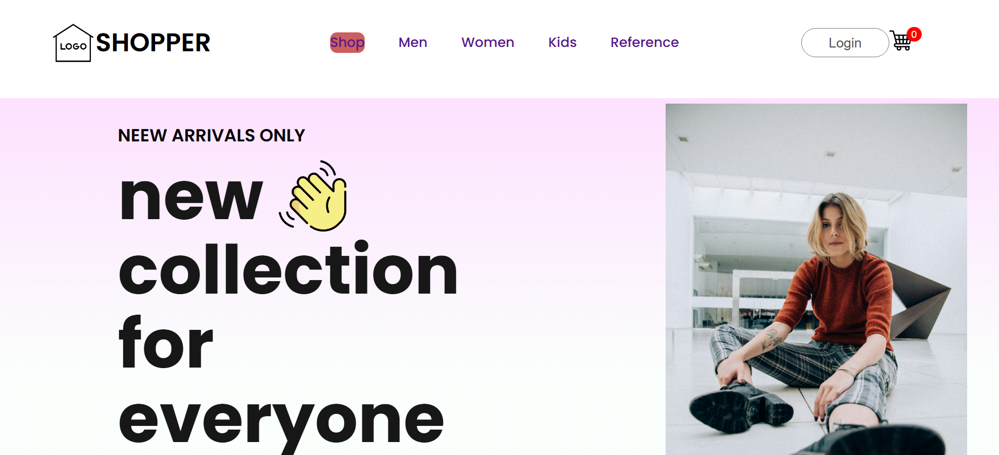
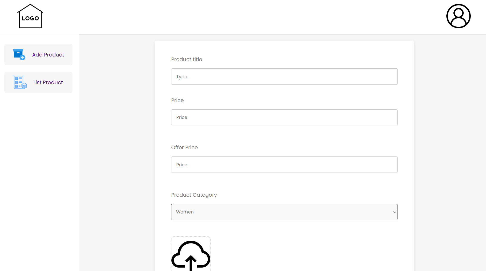
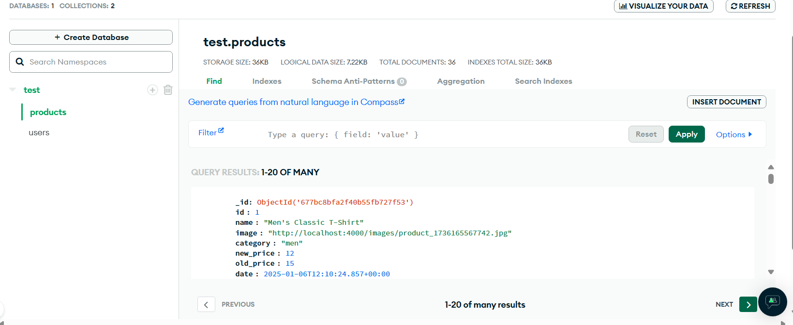

# Online Shopping Website

This is a side project focused on building an e-commerce website. The project is based on the tutorial "How to Create a Full Stack E-Commerce Website Using React JS, MongoDB, Express & Node JS 2024" from GreatStack. 

All icons and images used on the platform are download from Flaticon and Unsplash. The authors can be seen on the References page.

* Frontend: React
* Backend: Express, MongoDB
* Icons: FLATICON
* Images: Unsplash

Customers can select products to add to their shopping cart. Once they login, the items in their cart will be uploaded to the database, ensuring that the cart contents are saved. This means that when customers login again in the future, their previously added products will be displayed in the cart.

The administrator could upload new products to the platform and manage the product catalog. 

All products and user data are stored in MongoDB, ensuring efficient management. To protect the server, the URL for the database is hidden in .env.
